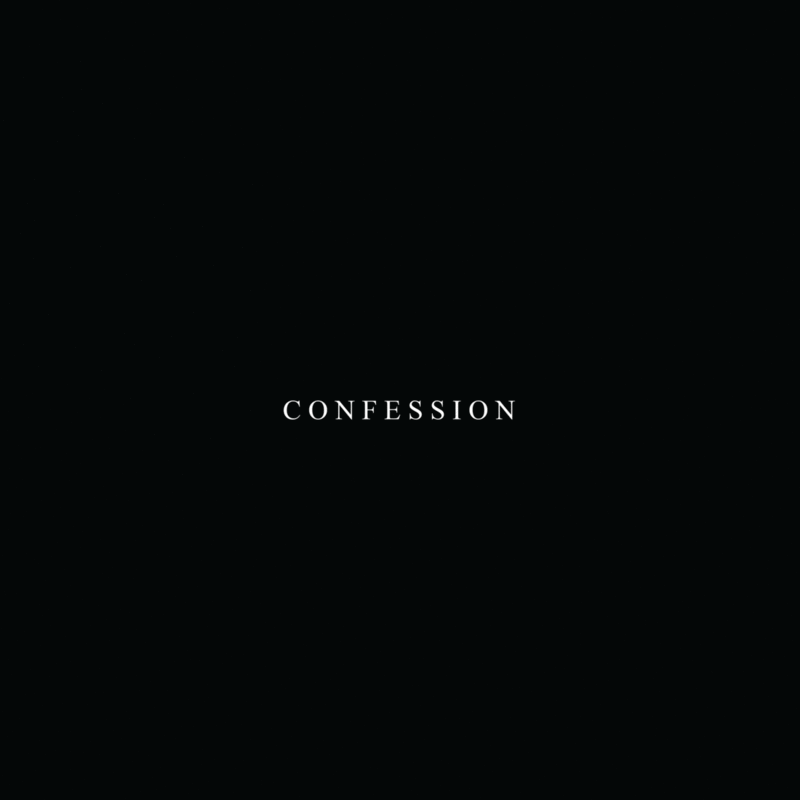
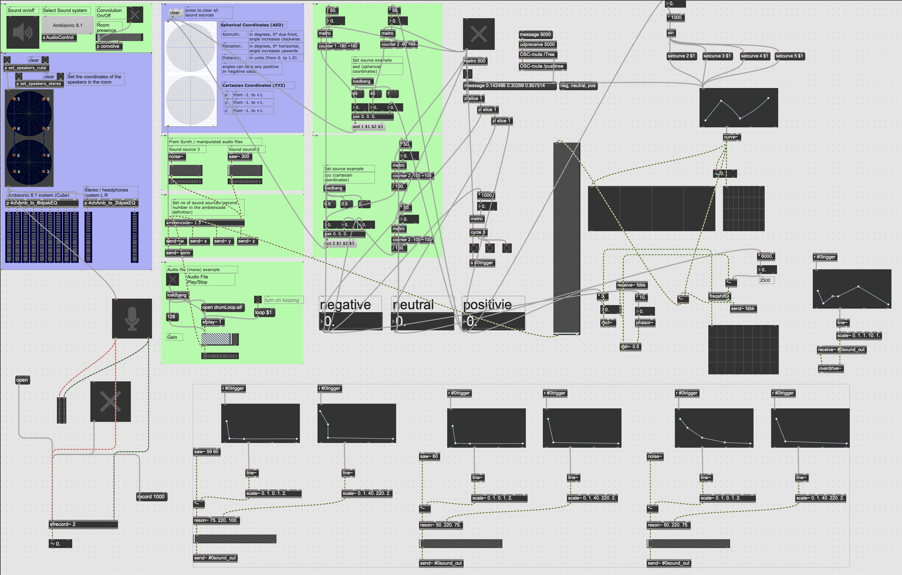

# Confession

In this teenage year of 21st, where the use of the World Wide Web and Social Media has become the widely used medium of communication. A platform that gains plasticity through the devotion of many believers that believe that the artificial social world, internet, a liberal paradise ex nihilo. However, the freedom did not last as the many have utilized it to create pandemonium to the society which ranged from planning a terrorist attack, dark web to the latter fake news hysteria, tout court. These significant event grant government every positive reason to deploy mass surveillance program to monitor us on the “site” by buying access into social media nor coercing them for the data handout. Paradise no more as from that onwards anything that we have shared, upload, comment and chat being watched by the big “brothers”. Long live privacy, the more exposure and expressive we are made us more susceptible to being watched or maybe being arrested. Ergo, we think that by concealing and mystify the things we shared be it emotions whether personal update into AI determination of sound abstractions would let us remain sociable yet giving us an agency towards privacy. In a nutshell, sharing become confessions. 

